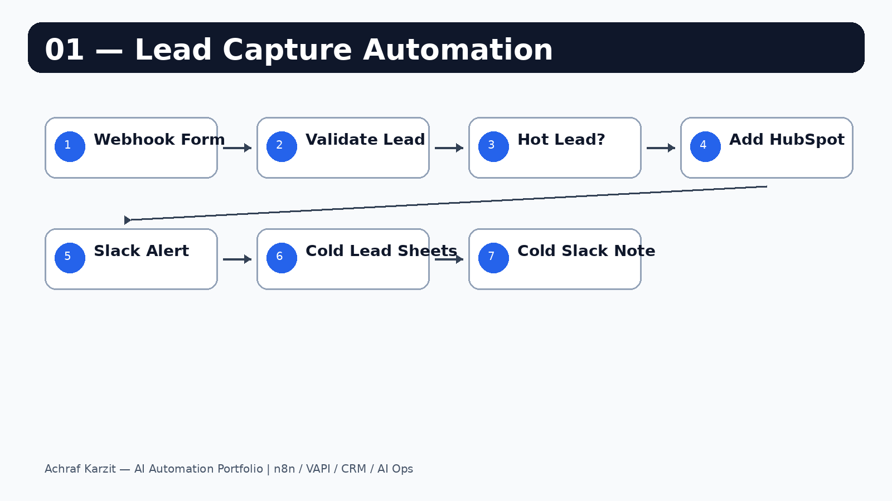

# Lead Capture Automation

Whenever someone fills out a form, this workflow automatically:

- Saves the lead to Google Sheets
- Adds complete leads to HubSpot
- Sends a Slack alert to the sales team
- Separates Hot and Cold leads based on required fields

No more manual copy-paste from forms into CRM.

---

## How it looks



---

## What you need

- n8n account
- Google Sheets credential
- HubSpot credential
- Slack credential

---

## Setup

1. Import `workflow.json` into n8n.
2. Connect Google Sheets, HubSpot and Slack credentials.
3. Select your spreadsheet and Slack channels.
4. Activate the workflow.
5. Copy the webhook URL and paste it into your form submit destination.

---

## Required form fields

```text
firstName, lastName, email, company, phone
```

---

## Test payload

```json
{
  "firstName": "Sara",
  "lastName": "Khan",
  "email": "sara@techcorp.com",
  "company": "TechCorp",
  "phone": "+212600000000"
}
```

---

## Safe to share

No passwords or API keys are stored in this workflow. Credentials are configured privately inside n8n.
