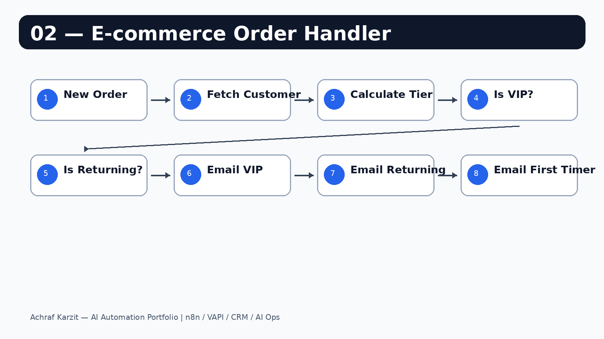

# E-commerce Order Handler — Loyalty Email Automation

When a new order comes in, the workflow checks the customer's history, calculates a loyalty tier, and sends a personalized email.

---

## How it looks



---

## What it does

```text
New Order Webhook
  → Fetch Customer Data
  → Calculate Loyalty Tier
  → Is VIP?
      YES → Send VIP email
      NO  → Is Returning?
              YES → Send Returning Customer email
              NO  → Send First Timer email
```

---

## Loyalty tiers

| Tier | Logic | Discount |
|---|---:|---:|
| First Timer | 0-1 prior orders | WELCOME5 |
| Returning | 2-4 prior orders | RETURN10 |
| VIP | 5+ prior orders | VIP20 |

---

## Setup

1. Import `workflow.json` into n8n.
2. Replace the demo API with Shopify/WooCommerce or your backend.
3. Connect Gmail.
4. Test with the payload below.

---

## Test payload

```json
{
  "userId": 7,
  "orderId": "ORD-1001",
  "product": "Automation Audit",
  "amount": 149
}
```
