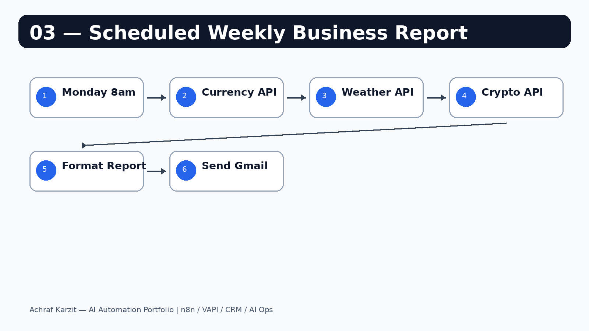
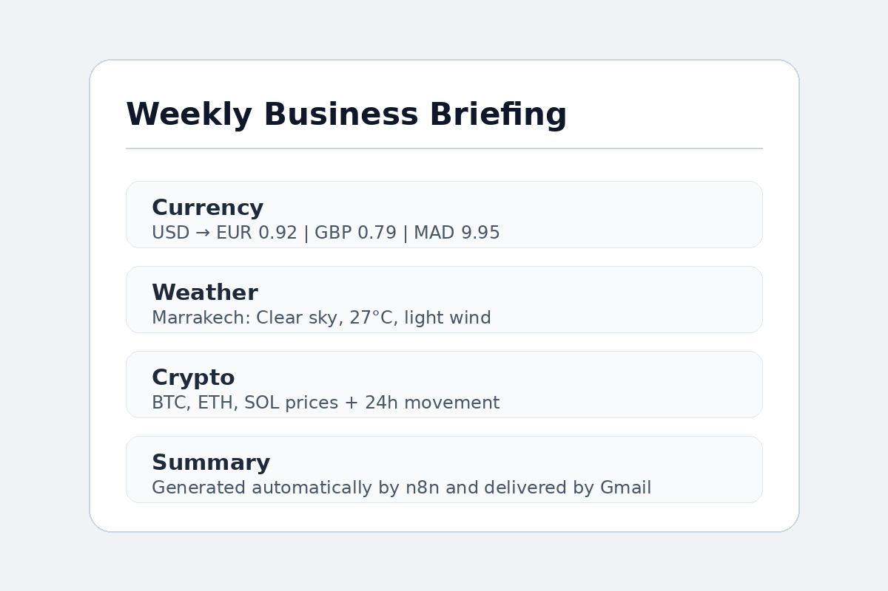

# Scheduled Weekly Business Report

Every Monday at 8am, this workflow fetches live data from public APIs and sends a clean email briefing automatically.

---

## Workflow



## Email output



---

## What it does

```text
Schedule Trigger
  → Fetch Currency Rates
  → Fetch Weather
  → Fetch Crypto Prices
  → Format Report
  → Send Weekly Report
```

---

## APIs used

| Section | API |
|---|---|
| Currency | open.er-api.com |
| Weather | api.open-meteo.com |
| Crypto | CoinGecko |

---

## Setup

1. Import `workflow.json` into n8n.
2. Connect Gmail.
3. Add your email in the `sendTo` field.
4. Update city coordinates if needed.
5. Activate the workflow.

> Test immediately by clicking **Execute Workflow** in n8n.
