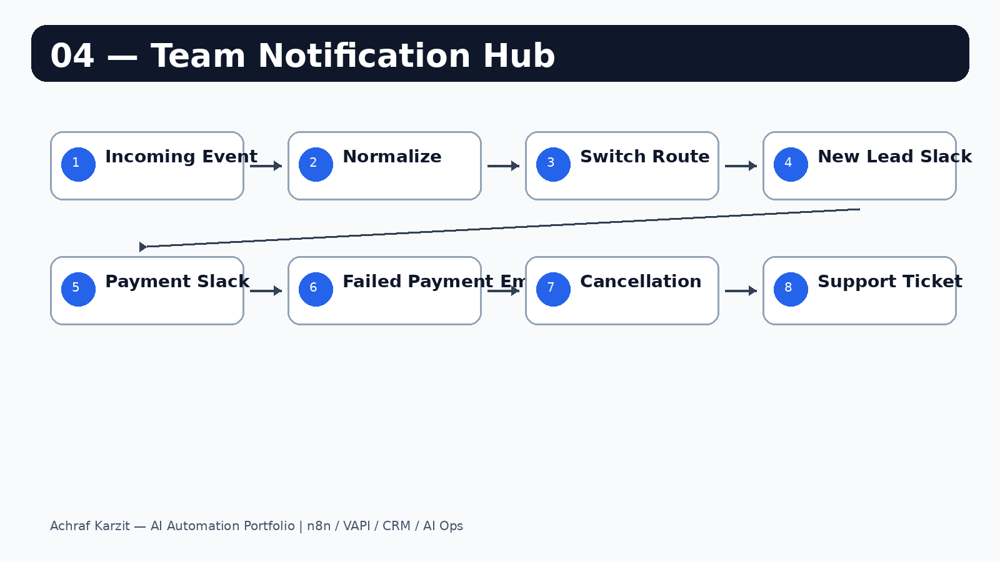

# Team Notification Hub

One webhook receives events from any source, validates them, routes by event type, posts to the right Slack channel, and escalates critical payment failures by email.

---

## Workflow



---

## What it does

```text
Incoming Event Webhook
  → Normalize Event
  → Route by Event Type
      new_lead         → Slack
      payment_received → Slack
      payment_failed   → Slack + Email alert
      cancellation     → Slack
      support_ticket   → Slack
```

---

## Supported event types

| Event | Slack | Email |
|---|---:|---:|
| `new_lead` | yes | no |
| `payment_received` | yes | no |
| `payment_failed` | yes | yes |
| `cancellation` | yes | no |
| `support_ticket` | yes | no |

---

## Test payloads

```json
{ "eventType": "new_lead", "name": "Sara Khan", "email": "sara@techcorp.com" }
```

```json
{ "eventType": "payment_failed", "name": "Ahmed Ali", "email": "ahmed@example.com", "amount": 149.99 }
```

---

## Setup

1. Import `workflow.json` into n8n.
2. Connect Slack on all Slack nodes.
3. Connect Gmail on the critical alert node.
4. Select your channels and email destination.
5. Activate and copy the production webhook URL.
