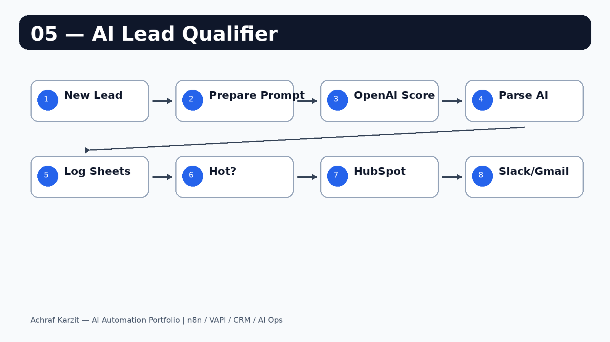

# AI Lead Qualifier — GPT-Powered Lead Scoring & Auto Routing

Every inbound lead is automatically scored 1-10 by AI, labeled Hot/Warm/Cold, logged in Google Sheets, and routed to sales only when it deserves action.

---

## Workflow



---

## What it does

```text
New Lead Webhook
  → Prepare Lead + Prompt
  → OpenAI Scoring Request
  → Parse AI Response
  → Log to Google Sheets
  → Is Hot? score 8-10
      YES → HubSpot + Slack + Gmail
      NO  → Is Warm? score 5-7
              YES → Slack note
              NO  → Sheets only
```

---

## AI scoring tiers

| Tier | Score | Action |
|---|---:|---|
| Hot | 8-10 | HubSpot + Slack + Gmail |
| Warm | 5-7 | Slack note |
| Cold | 1-4 | Logged only |

---

## Setup

1. Import `workflow.json` into n8n.
2. Replace `YOUR_OPENAI_API_KEY` in the HTTP Request node.
3. Create a Google Sheet with these headers:

```text
name | company | email | role | budget | message | source | score | label | action | reason | submittedAt
```

4. Connect Google Sheets, HubSpot, Slack and Gmail.
5. Add your sales email in the Gmail node.
6. Activate and point your form to the webhook.

---

## Test payload

```json
{
  "name": "James Wilson",
  "company": "TechCorp Solutions",
  "email": "james@techcorp.com",
  "role": "CTO",
  "budget": "$5000/month",
  "message": "We need to automate our sales pipeline immediately.",
  "source": "LinkedIn"
}
```

---

## Pitch

> Your sales team should not manually read every lead. This workflow uses AI to score and route leads instantly, so reps focus only on opportunities with budget, urgency and authority.

---

## Security note

Before pushing to GitHub, confirm the OpenAI key is still a placeholder. Never publish real API keys.
