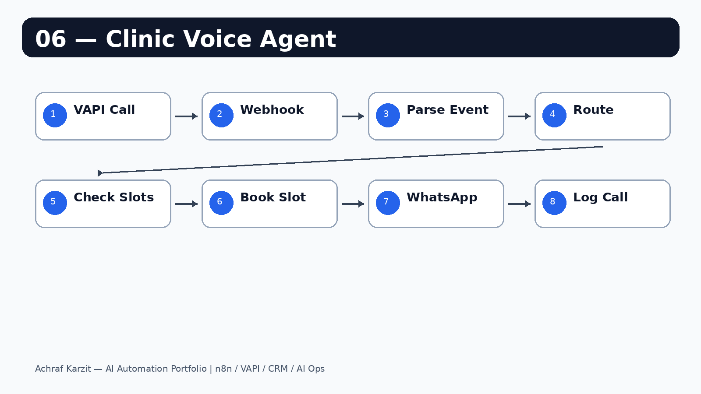

# 06 — Clinic Voice Agent (AI Receptionist)

AI voice receptionist for a clinic built with VAPI + n8n + Twilio WhatsApp.

---

## What it does

- Answers inbound calls and understands appointment requests
- Checks appointment availability from Google Sheets
- Books a slot when available
- Sends WhatsApp confirmation via Twilio
- Logs call details and booking outcomes

---

## Preview

---

## Stack

| Layer | Tool |
|---|---|
| Voice agent | VAPI |
| LLM | OpenAI or Groq |
| Transcriber | Deepgram |
| Automation | n8n |
| Confirmation | Twilio WhatsApp |
| Database | Google Sheets |

---

## VAPI configuration

- Assistant prompt: `vapi/prompt.txt`
- Setup notes: `vapi/settings.md`
- Example config: `vapi/assistant-config.json`

---

## n8n workflow

Import `n8n/workflow.json` directly into n8n.

### Workflow nodes

1. VAPI Webhook → Parse Event → Route Event
2. Slots branch: Read appointments → Calculate available slots → Respond to VAPI
3. Booking branch: Double-booking guard → Save appointment → Send WhatsApp → Respond booked
4. Call log branch: Log call → Respond OK

---

## Setup

1. Import the workflow JSON into n8n.
2. Connect Google Sheets OAuth credential.
3. Add Twilio credentials.
4. Set your Twilio WhatsApp number in the Send WhatsApp node.
5. Paste `vapi/prompt.txt` into the VAPI assistant.
6. Point the VAPI tool webhook URL to your n8n webhook.

---

## Notes

- Phone numbers are normalized to E.164 format.
- Caller number is used as fallback if the patient does not provide a number.
- Double-booking guard prevents two patients from taking the same slot.
